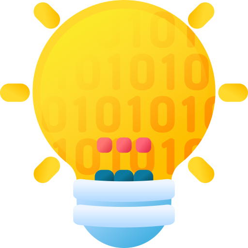

[](https://classroom.github.com/a/IYE4ssuc)
# Unidad No. 2
## Información del estudiante  
Nombre del estudiante:  Laura Martínez Correa
Id.: 000533807
---
# ¿Qué es un computador?   🖥️💻
*Un computador, también conocido como computadora u ordenador, es una máquina programable y compleja que procesa y ejecuta órdenes para realizar diversas tareas Es un dispositivo electrónico que recibe datos (como números, texto o imágenes), los procesa mediante un conjunto de instrucciones (un programa) y los transforma en información útil.*

🖥️🖥️🖥️🖥️🖥️


## **Partes de un computador**
Un computador se compone de dos partes esenciales: 
*hardware y software*
Hardware El hardware se refiere a los componentes físicos y tangibles de un computador, como el teclado, el ratón, la pantalla, los cables y las placas. Los componentes de hardware se pueden clasificar en internos y externos 
**Componentes internos:**
*Procesador (CPU):* Ejecuta instrucciones de programas y procesa datos También se le conoce como el "cerebro" del computador. La CPU consta de la Unidad Aritmético Lógica (ALU), la Unidad de Control (UC) y registros
*Memoria (RAM y ROM):* La memoria RAM (Random Access Memory) almacena datos a corto plazo y las instrucciones que se están ejecutando. La memoria ROM (Read-Only Memory) es un medio de almacenamiento que solo permite la lectura de información
*Placa madre:* Es una tarjeta de circuito impreso a la que se conectan los componentes del computador 
*ALU (Unidad Aritmético-Lógica):*
Realiza operaciones lógicas, matemáticas o formales que sostienen el sistema 
*Unidad de Control (UC):*
Coordina y controla el flujo de datos dentro del sistema 
*Registros:*
Espacios de almacenamiento de alta velocidad dentro de la CPU que se utilizan para guardar datos e instrucciones que se están utilizando activamente 
*Buses:*
Sistemas de comunicación que transfieren datos entre los componentes del computador 

#### 🖱️🖱️ ⌨️⌨️ **Componentes externos:** 🖱️🖱️ ⌨️⌨️


*Periféricos de entrada:* 
Permiten el ingreso de datos al computador (ej. teclado, ratón) 
*Periféricos de salida:* 
Muestran la información procesada al usuario (ej. monitor, impresora) 
*Dispositivos de almacenamiento:* 
Discos que almacenan información, incluyendo el sistema operativo, programas y archivos del usuario 

### **Componentes internos** 


*Software:* El software es el conjunto de programas, sistemas operativos y funciones instaladas en el computador que coordinan el hardware para funcionar  Incluye el sistema operativo (SO) y las aplicaciones.
*Sistema operativo:* Actúa como una interfaz entre el hardware y las aplicaciones, coordinando el acceso a los recursos del computador 
*Aplicaciones:* Programas que realizan tareas específicas, como edición de textos, reproducción de música o navegación web 
*Software de desarrollo:* Herramientas utilizadas para crear, probar y depurar otros programas (ej. compiladores, entornos de desarrollo integrados (IDEs)) 

### **Funcionamiento general de un computador**
Un computador funciona recibiendo datos de entrada a través de periféricos, procesándolos en la CPU mediante la ejecución de programas (software) almacenados en la memoria, y enviando la información resultante a través de los periféricos de salida La CPU, que incluye la ALU y la Unidad de Control, es responsable de realizar operaciones lógicas y aritméticas y de coordinar el flujo de datos dentro del sistema. 
El sistema operativo gestiona los recursos del hardware y permite que las aplicaciones interactúen con el computador.

🏗️🏗️ **Arquitecturas de un computador:**


La arquitectura de un computador se refiere a su diseño conceptual y la estructura operacional fundamental de un sistema de computación 
Describe cómo están interconectados sus componentes de hardware y cómo interactúan para ejecutar programas.

**Arquitectura CISC (Complex Instruction Set Computing):** 
CISC se caracteriza por un conjunto de instrucciones amplio y complejo, diseñado para realizar tareas complejas con pocas instrucciones. Los computadores con arquitectura CISC, como los procesadores Intel x86, se encuentran comúnmente en equipos de escritorio y portátiles modernos
Arquitectura RISC (Reduced Instruction Set Computing): RISC utiliza un conjunto de instrucciones más pequeño y simple, lo que permite una ejecución más rápida de cada instrucción. Esta arquitectura se encuentra en dispositivos móviles, servidores y sistemas integrados, como los procesadores ARM.

**Registros:**


*Caché:* Memoria de alta velocidad utilizada para almacenar datos a los que se accede con frecuencia, lo que acelera el acceso a la información.

*Principal (RAM):* Almacena datos e instrucciones que la CPU está utilizando actualmente. Es de acceso aleatorio y volátil, lo que significa que los datos se pierden cuando se apaga el computador.

*Secundaria (Disco duro y unidades externas de almacenamiento):* 
Almacena datos a largo plazo, incluyendo el sistema operativo, programas y archivos del usuario. Es no volátil, lo que significa que los datos se conservan cuando se apaga el computador.

**Dispositivos de entrada/salida:**
*Entrada:* Permiten el ingreso de datos al computador (ej. teclado, ratón) 

*Salida:* 
Muestran la información procesada al usuario (ej. monitor, impresora) s

**¿Qué sucede desde que ingreso un dato a través del teclado, hasta que veo el resultado de la operación en la pantalla?** 
Cuando se ingresa un dato a través del teclado, la señal se envía a la CPU, donde se procesa según las instrucciones del programa en ejecución. Luego, el resultado se envía a la tarjeta de video, que lo muestra en la pantalla 
¿Cómo se codifican los datos internamente en el computador? Los datos se codifican internamente en el computador utilizando el sistema binario, que representa la información mediante combinaciones de 0 y 1.

**¿Cuáles son las unidades de medida de datos en un computador?**
*Bit:* La unidad más pequeña de información, que representa un 0 o un 1.

-*Byte:* Un grupo de 8 bits.

-*Kilobyte (KB):* 1024 bytes.

-*Megabyte (MB):* 1024 kilobytes.

-*Gigabyte (GB):* 1024 megabytes.

-*Terabyte (TB):* 1024 gigabytes.

*REFERENCIAS:*
1. https://concepto.de/computador/
2. https://courses.minnalearn.com/es/courses/digital-revolution/the-computing-revolution/computer-basics/ 
3. https://es.wikipedia.org/wiki/Computadora
4. https://concepto.de/computadora/


# Mapa Conceptual 

[Link a mí mapa conceptual](Uhttps://cards.algoreducation.com/app/set/67abf9515bdf6708a9540654?sheetId=67abf9555bdf6708a9540667)


# LENGUAJES CON SUS TIPOS DE DATOS
## Comparación de Tipos de Datos

| Tipo de Dato | Lenguaje | Definición en Español                                                                 | Tamaño (bytes) | Notas                                                                                                     |
|--------------|----------|---------------------------------------------------------------------------------------|-----------------|-----------------------------------------------------------------------------------------------------------|
| `int`        | C/C++    | Representa números enteros.                                                           | 4               |                                                                                                           |
| `char`       | C/C++    | Representa un solo carácter.                                                           | 1               |                                                                                                           |
| `float`      | C/C++    | Representa números de punto flotante de precisión simple.                             | 4               |                                                                                                           |
| `double`     | C/C++    | Representa números de punto flotante de doble precisión.                             | 8               |                                                                                                           |
| `void`       | C        | Indica la ausencia de valor o tipo.                                                  | -               |                                                                                                           |
| `bool`       | C++      | Representa valores booleanos (`true` o `false`).                                    | 1               |                                                                                                           |
| `string`     | C++      | Representa una secuencia de caracteres (cadena de texto).                           | Variable         |                                                                                                           |
| `int`        | Java     | Representa números enteros.                                                           | 4               |                                                                                                           |
| `char`       | Java     | Representa un solo carácter Unicode.                                                  | 2               |                                                                                                           |
| `float`      | Java     | Representa números de punto flotante de precisión simple.                             | 4               |                                                                                                           |
| `double`     | Java     | Representa números de punto flotante de doble precisión.                             | 8               |                                                                                                           |
| `boolean`    | Java     | Representa valores booleanos (`true` o `false`).                                    | 1               |                                                                                                           |
| `byte`       | Java     | Representa un número entero pequeño.                                                  | 1               |                                                                                                           |
| `short`      | Java     | Representa un número entero corto.                                                   | 2               |                                                                                                           |
| `long`       | Java     | Representa un número entero largo.                                                   | 8               |                                                                                                           |
| `int`        | Python   | Representa números enteros.                                                           | Variable         | El tamaño depende de la magnitud del número.                                                             |
| `float`      | Python   | Representa números de punto flotante.                                                | 8               | Generalmente se implementa como un `double` de C.                                                        |
| `str`        | Python   | Representa una secuencia de caracteres (cadena de texto).                           | Variable         | Depende de la longitud de la cadena y la codificación (UTF-8, etc.).                                       |
| `bool`       | Python   | Representa valores booleanos (`True` o `False`).                                    | Variable         | Generalmente ocupa poco espacio, pero puede depender de la implementación.                               |
| `list`       | Python   | Representa una colección ordenada y mutable de elementos.                            | Variable         | Depende del número de elementos y el tamaño de cada elemento.                                              |
| `tuple`      | Python   | Representa una colección ordenada e inmutable de elementos.                          | Variable         | Depende del número de elementos y el tamaño de cada elemento.                                              |
| `dict`       | Python   | Representa una colección de pares clave-valor.                                     | Variable         | Depende del número de pares y el tamaño de las claves y los valores.                                     |

**Notas Adicionales sobre Python:**

*   En Python, el tamaño en bytes de algunos tipos (especialmente `int`, `str`, `list`, `tuple`, `dict`) puede variar significativamente dependiendo de la cantidad de datos almacenados y de la versión de Python que se esté utilizando.
*   Python gestiona automáticamente la memoria, por lo que no hay una asignación de tamaño fija como en C o Java.


# Representación de datos en una computadora:

En esencia, una computadora representa toda la información utilizando el sistema binario, es decir, ceros y unos. Ya sean números, letras, imágenes o sonidos, todo se traduce a patrones de bits. Los números se representan directamente en binario, mientras que las letras se codifican mediante tablas de caracteres como ASCII o Unicode. Las imágenes se dividen en píxeles, y a cada píxel se le asigna un patrón de bits que indica su color. El sonido se digitaliza y se representa mediante diferentes codificaciones binarias. En resumen, la computadora maneja todo como secuencias de bits, y la forma en que interpreta esos bits depende del contexto y del tipo de dato.

# Conclusiones sobre variables binarias:

Cada variable binaria puede representar dos estados (0 o 1). Con N variables binarias, se pueden representar 2^N estados diferentes. Por ejemplo, con 3 bits, se pueden representar 8 estados diferentes (2^3 = 8), y con 4 bits, se pueden representar 16 estados diferentes (2^4 = 16).

Aquí tienes la información para tu ejercicio de cálculo de espacio en memoria y la conclusión:


5.  **Ejercicio de cálculo de espacio en memoria**

Para calcular el espacio total requerido en memoria, primero debemos determinar el tamaño de cada tipo de dato:


*   **Identificador numérico (entero):** Asumimos un entero de 4 bytes (32 bits).
*   **Temperatura (punto flotante):** Asumimos un punto flotante de 4 bytes (32 bits).
*   **Valor lógico (booleano):** 1 byte es suficiente para representar un valor booleano.
*   **Texto (10 caracteres):** Asumiendo que cada carácter ocupa 1 byte (ASCII), el texto ocupará 10 bytes.

Por lo tanto, cada conjunto de datos requiere:

4 bytes (entero) + 4 bytes (float) + 1 byte (booleano) + 10 bytes (texto) = 19 bytes

La información se almacena cada 10 segundos durante 24 horas. Primero, calculamos cuántas veces se almacena la información en 24 horas:

*   Hay 60 segundos en un minuto y 60 minutos en una hora, entonces hay 3600 segundos en una hora.
*   En 24 horas, hay 24 horas \* 3600 segundos/hora = 86400 segundos.
*   Si se almacena cada 10 segundos, entonces se almacena 86400 segundos / 10 segundos/almacenamiento = 8640 almacenamientos.

Finalmente, calculamos el espacio total requerido:

8640 almacenamientos \* 19 bytes/almacenamiento = 164160 bytes

Para expresar esto en kilobytes (KB), dividimos por 1024:

164160 bytes / 1024 bytes/KB = 160.3125 KB

Para expresar esto en megabytes (MB), dividimos por 1024^2:

164160 bytes / 1048576 bytes/MB = 0.1565 MB

**Resultado Final:** Se requieren aproximadamente 164160 bytes, 160.3125 KB, o 0.1565 MB para almacenar estos datos.


6.  **Conclusión**

Esta actividad me ha demostrado cómo diferentes tipos de datos consumen distintas cantidades de memoria, y cómo la frecuencia con la que se almacenan esos datos impacta significativamente en el espacio total requerido. Aprendí que es crucial considerar el tipo de dato más eficiente para cada variable y la frecuencia de almacenamiento, especialmente cuando se trabaja con grandes volúmenes de información, ya que esto puede influir en la eficiencia y el rendimiento del programa. Además, comprendí mejor cómo las computadoras representan internamente la información utilizando bytes, kilobytes y otras unidades de medida.


# Símbolos usados en programación:

.png>)

*   **Línea de flujo:**
```
 `-->`  o `→`
 ```
*   **Terminal:** 
```
`( )` 
```
(con "Inicio" o "Fin" dentro)
*   **Proceso:** 
```
`[ ]`
```
*   **Decisión:** 
```
`<>`
```
*   **Entrada/Salida:** 
```
`/ /`
```
*   **Anotación/Comentario:** 
```
`/* */`
```
*   **Proceso predefinido:** 
```
`[[ ]]`
```
*   **Conector en la página:** 
```
`(A)` , `(B)`, `(C)`... 
```
(la letra cambia)
*   **Conector fuera de página:** 
```
`[[A]]`, `[[B]]`, `[[C]]`... 
```
(para diferenciar del conector en la página)
*   **Retraso:** 
```
` D ` 
```
(Una D mayúscula con espacio a cada lado, como una aproximación)
*   **Datos:** Similar a la Entrada/Salida, podríamos usar 
```
`/ /` 
```
(aunque no es ideal)
*   **Documento:** 
```
`|_|`
```
*   **Multi-documento:** 
```
`||_||`
```
*   **Preparación:**  Es similar al proceso, podrías usar 
```
`[Prep]` 
```
para indicar que es preparación.
*   **Display/Pantalla:** 
```
`|o|`  
```
(simulando una pantalla)
*   **Entrada manual:** 
```
`(teclado)`
```
 (para indicar que es entrada manual)
*   **Operación manual:** 
```
`(mano)`
```
 (para representar una operación manual)


# ALGORITMOS 📤📥


# Identificar Algoritmos

❌*Una página web no es un algoritmo, es un medio de presentación de información, pero no necesariamente sigue pasos secuenciales para resolver un problema.*

✅*Una receta para hacer un pastel sí es un algoritmo, ya que presenta instrucciones claras, en orden y con un resultado esperado.*

❌*"Piensa en un número y multiplícalo por otro" no es un algoritmo porque no tiene un conjunto de pasos definidos ni garantiza un resultado único.*

✅*Un manual de instrucciones para armar un mueble sí es un algoritmo, pues describe un proceso detallado y ordenado para lograr un objetivo.*

❌*Una lista de compras organizada en orden alfabético no es un algoritmo, ya que no define una secuencia de pasos ni tiene un objetivo de procesamiento.*


# Variables y Constantes

🔵 Constante: El valor de la gravedad en la Tierra (9.8 m/s²) no cambia.

🔴 Variable: La edad de una persona cambia cada año.

🔴 Variable: El dinero en una cuenta bancaria varía con los depósitos y retiros.

🔵 Constante: La velocidad de la luz en el vacío es un valor fijo.

🔴 Variable: El radio de un círculo puede cambiar dependiendo del círculo.


# Características de los Algoritmos

✅ Sí cumple: 

Evalúa distintas rutas y sigue un proceso lógico hasta encontrar la mejor opción.

✅ Sí cumple: 

Indica pasos específicos (sumar y mostrar resultado), lo que define un algoritmo.

✅ Sí cumple: 

Define un conjunto de pasos ordenados y con un objetivo claro.

✅ Sí cumple: 

Tiene una secuencia clara, condiciones de inicio y fin, y logra un propósito específico.


# Comprensión de Herramientas

❌ Falso. El pseudocódigo usa una escritura estructurada pero no símbolos gráficos estándar.

✅ Verdadero. Los diagramas de flujo representan un algoritmo gráficamente.

❌ Falso. El pseudocódigo no depende de un lenguaje de programación específico.

✅ Verdadero. Un diagrama de flujo debe tener un punto de inicio y fin para ser válido.




#  Estructuras de Control

**Las estructuras de control permiten decidir qué camino tomar en un programa o proceso según una condición.**

**Ejemplo de la vida diaria:**

Si suena la alarma por la mañana, decido levantarme. Si es fin de semana, sigo durmiendo.

**Ejemplo matemático:**

Si un estudiante obtiene una calificación mayor o igual a 60, aprueba la materia; de lo contrario, reprueba.


