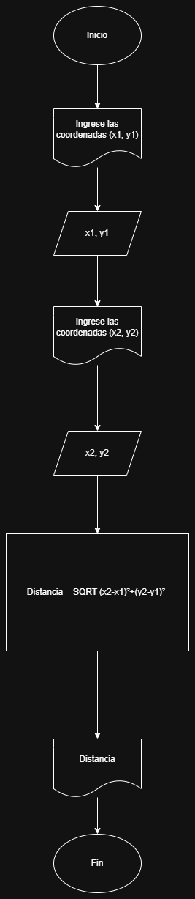

# 1. DISTANCIA ENTRE DOS PUNTOS 🚏
    Inicio
    Escribir "Ingrese las coordenadas (x1, y1) del primer punto
    Leer x1, y1
    Escribir "Ingrese las coordenadas (x2, y2) del segundo punto

    Distancia = SQRT(X2-X1)²+(Y2-Y1)²

    Imprimir Distancia
    Fin

# 2. TELAS 🧶🧵👔
    Inicio
    Escribir "Ingrese la cantidad de metros que desea pedir"
    Leer cantidad

    Pulgadas = cantidad * 39.37

    Imprimir Pulgadas
    Fin

# 3. TRIÁNGULO RECTÁNGULO 🔺📐📐
    Inicio
    Escribir "Ingrese el cateto opuesto"
    Leer cateto opuesto
    Escribir "Ingrese el cateto adyacente"
    Leer cateto adyacente

    Hipotenusa = cateto opuesto² + cateto adyacente²

    Hipotenusa = SQRT(Hipotenusa²)  

    Imprimir Hipotenusa
    Fin

# 4. ¡CUMPLEAÑOS! 🎊🎉🍰🥧
    Inicio
    Escribir "Ingrese su fecha de nacimiento dn/mn/an:"
    Leer dn, mn, an
    Leer da, ma, aa

    Si mn < ma 
    Edad = aa - an 
        
        Sino Si mn = ma Entonces
        
        Si dn < da 
            Sino Si dn = da Entonces
            Escribir "¡Feliz Cumpleaños 🎉🎊!"
        Sino
            Edad = (aa - an) - 1
        Fin Si
    Sino
        Edad = (aa - an) - 1
    Fin Si

    Escribir "Su edad es: ", Edad
    Fin

# 5. SUELDO DE UN TRABAJADOR 👷‍♂️👷‍♀️👷‍♂️👷‍♀️
    Inicio
    Escribir "Ingrese el sueldo por hora del trabajador" 
    Leer vh
    Escribir "Ingrese horas trabajadas"
    Leer ht

    Si ht > 50
    Escribir "valor no permitido 50 es el máximo de horas"
    Si no  
    Si ht < 40 
        Vt = ht*vh

    Si no 
        Si ht > 40 y ht < 45
            Vt = (40*vh)+((40-ht)*2)

        Si no 
            Si ht > 45 y ht < 50
            Vt = (40*vh)+((5)*2)+((45-ht)*3)
    Fin Si
        Fin Si
            Fin Si

    Imprimir "El sueldo total es igual a: Vt"
    Fin

# 6. N CANTIDADES 🦺🦺
    Inicio
    // Definir las variables necesarias
    Definir N como Entero  // Número total de entradas
    Definir contadorCero como Entero  // Contador para ceros
    Definir contadorMenorCero como Entero  // Contador para números menores a cero
    Definir contadorMayorCero como Entero  // Contador para números mayores a cero

    // Inicializar los contadores en cero
    contadorCero <- 0
    contadorMenorCero <- 0
    contadorMayorCero <- 0

    // Solicitar al usuario la cantidad de números a ingresar
    Escribir "Ingrese la cantidad de números (N):"
    Leer N

    // Inicio bucle para ingresar N números
    Para indice desde 1 hasta N Hacer
        // Definir la variable para almacenar el número ingresado
        Definir numero como Real
        Escribir "Ingrese el número ", indice, ":"
        Leer numero

        // Clasificar el número ingresado
        Si numero = 0 Entonces
            contadorCero <- contadorCero + 1  // Incrementar contador de ceros
        Sino Si numero < 0 Entonces
            contadorMenorCero <- contadorMenorCero + 1  // Incrementar contador de números menores a cero
        Sino
            contadorMayorCero <- contadorMayorCero + 1  // Incrementar contador de números mayores a cero
        Fin Si
    Fin Para

    // Mostrar los resultados al usuario
    Escribir "Cantidad de ceros: ", contadorCero
    Escribir "Cantidad de números menores a cero: ", contadorMenorCero
    Escribir "Cantidad de números mayores a cero: ", contadorMayorCero
    Fin

# 7. AHORRANDO EXPONENCIALMENTE 💷💸💰
    Inicio
    Definir ahorro_diario = 0.03
    Definir ahorro_total = 0

    Desde día = 1 hasta día = 365 
    ahorro_diario = ahorro_diario * 3
    ahorro_total = ahorro_total + ahorro_diario
        
    Fin Desde

    Imprimir "Ahorro total en un año: ", ahorro_total, ahorro_diario" pesos"
    Fin 

# 8. DESCUENTO EN N ARTÍCULOS 🎟🎫💎
    Inicio
    Escribir "Ingrese el precio de los artículos comprados"
    Leer precio

    Si precio >= $200
    Precio total: precio - (precio*15%)

        Si no
            Si $200 > precio > $100
             Precio total :  precio - (precio*12%)

                Si no 
                    Si precio < $100
                    Precio total : precio - (precio*10%)
    Fin Si            
         Fin Si
                Fin Si

                    Imprimir "Tu precio total es:",  Precio total
    Fin

# 9. FUNCIÓN EXPONENCIAL 📕📖✏🖋🖌🖍📈
    Inicio
    Escribir "Ingrese el valor de x:"
    Leer x
    Escribir "Ingrese los términos que desea calcular de e^x"
    Leer n 

    valorExponencial <- 1  // Inicializo el valor de e^x
    término <- 1           // Inicializo el primer término de la serie
    fact <- 1              // Inicializo el factorial
    contador <- 1          // Inicializo el contador de términos

    Mientras contador < n Hacer
        // Calcular el siguiente término de la serie
        término <- (x ^ contador) / fact  
        
        // Sumar el término al valor total de e^x
        valorExponencial <- valorExponencial + término  
        
        // Calcular el factorial para el siguiente término
        fact <- fact * (contador + 1)  // Actualizamos el factorial para el siguiente término
        
        // Incrementar el contador
        contador <- contador + 1  
    Fin Mientras 

    Escribir "El valor aproximado de e^x es:", valorExponencial
    Fin

# 10. FUNCIÓN SENO 🧩⚙🗃📇📚
    Inicio
    Escribir "Ingrese el valor de x en grados:"
    Leer xGrados
    
    xRadianes = xGrados * (π / 180)

    Escribir "Ingrese el número de términos que desea imprimir para calcular sen_x"
    Leer n

    valorSeno <- xRadianes  // Inicializo el valor de sen(x) con el primer término
    término <- xRadianes     // Inicializo el primer término de la serie
    fact <- 1                // Inicializo el factorial
    contador <- 1            // Inicializo el contador de términos
    signo <- -1              // Inicializo el signo para el siguiente término

    Mientras contador < n Hacer  // Usamos n términos para la aproximación
        // Calcular el siguiente término de la serie
        término <- término * (xRadianes ^ 2) / ((2 * contador) * (2 * contador + 1))  
        
        // Sumar el término al valor total de sen_x
        valorSeno <- valorSeno + (signo * término)  
        
        // Cambiar el signo para el siguiente término
        signo <- -signo  
        
        // Incrementar el contador
        contador <- contador + 1  
    Fin Mientras 

    Escribir "El valor aproximado de sen_x es:", valorSeno
    Fin
